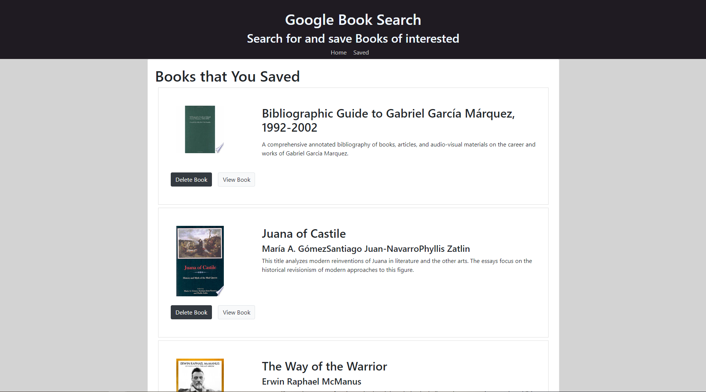

# Google Book Search: React | JavaScript | Node.js | Bootstrap | Google API | Express | MongoDB | MySQL | 

MERN-Stack App created with React components, work with helper/util functions, and utilize React lifecycle methods to query and display books based on user searches. also it uses Node, Express and MongoDB so that users can save books to review or purchase later.

# Home Page Screen

# Home Page Screen - Book Searched
  

# Saved Page Screen 
  

# The Book's information link as returned from the Google Books API

  

## Preview

You can check out [live preview](https://google-books-search-myapp.herokuapp.com/).

## Quick Start
1.  Clone the repo `git clone https://github.com/joswald123/Google-Books-app.git`
2.  Go to your project folder from your terminal
3.  Run: `npm install` or `yarn install`
4.  After install, run: `npm run start` or `yarn start`
5.  It will open your browser(http://localhost:3000)
